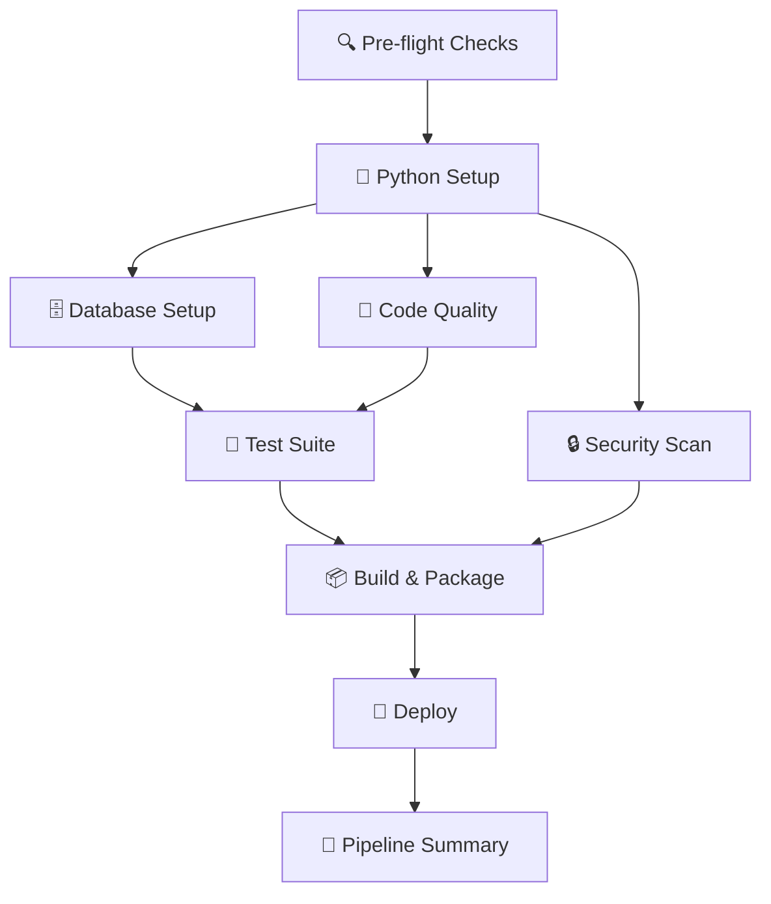

# 🤖 GitHub Actions CI/CD Pipeline

Comprehensive documentation for the AI Report Writer GitHub Actions workflow that provides automated testing, quality assurance, security scanning, and deployment.

## 🎯 Overview

The `ai_reporter.yaml` workflow provides a complete CI/CD pipeline with the following stages:



## 🚀 Workflow Triggers

### Automatic Triggers
- **Push to main/develop**: Full pipeline with deployment
- **Pull requests**: Quality checks and testing (no deployment)
- **Feature branches**: Testing and validation

### Manual Triggers
- **Workflow Dispatch**: Manual execution with options
  - Environment selection (staging/production)
  - Security scan toggle
  - Custom parameters

## 📋 Pipeline Stages

### 1. 🔍 Pre-flight Checks
**Purpose**: Environment validation and workflow configuration

**What it does**:
- ✅ Validates Python and Node.js versions
- ✅ Determines deployment requirements
- ✅ Sets up pipeline configuration
- ✅ Creates workflow summary

**Outputs**:
- Python version to use
- Deployment decision (true/false)
- Target environment (staging/production)

### 2. 🐍 Python Environment Setup
**Purpose**: Establishes Python environment and dependency management

**Steps**:
1. **Python Installation**: Sets up Python 3.11
2. **Cache Management**: Implements intelligent dependency caching
3. **Dependency Installation**: Installs from `requirements.txt`
4. **Environment Verification**: Tests core imports and versions

**Optimizations**:
- 📦 **Dependency Caching**: Speeds up subsequent runs
- 🔍 **Import Verification**: Ensures all packages work correctly
- 📊 **Environment Reporting**: Provides detailed setup summary

### 3. 🗄️ Database Setup & Migrations
**Purpose**: Database initialization and schema management

**Process**:
1. **Environment Configuration**: Creates test environment
2. **Directory Creation**: Sets up required folders
3. **Django System Check**: Validates configuration
4. **Migration Creation**: Generates new migrations
5. **Migration Application**: Applies schema changes
6. **Database Validation**: Tests model accessibility

**Features**:
- 🔧 **Automated Setup**: No manual intervention required
- 🗄️ **Migration Management**: Handles schema changes
- ✅ **Validation**: Confirms database functionality
- 📊 **Model Testing**: Verifies all models work correctly

### 4. 🧪 Comprehensive Test Suite
**Purpose**: Thorough testing of all application functionality

**Test Types**:
- **Custom Test Suite**: Runs `run_tests.py` with detailed reporting
- **Django Tests**: Standard Django test framework
- **Coverage Analysis**: Code coverage measurement and reporting

**Features**:
- 🧪 **Multi-layer Testing**: Custom and Django tests
- 📊 **Coverage Reports**: HTML and console output
- 📤 **Artifact Upload**: Test results and coverage data
- 🔍 **Failure Analysis**: Detailed error reporting

**Test Environment**:
```yaml
Environment Variables:
- DEBUG=True
- TESTING=True
- DISABLE_API_CALLS=True
- Test database isolation
- Mock external services
```

### 5. 🎨 Code Quality & Formatting
**Purpose**: Automated code quality assurance

**Quality Checks**:
1. **Import Sorting** (isort): Consistent import organization
2. **Code Formatting** (black): Standardized code style
3. **Linting** (flake8): Code quality and style issues
4. **Type Checking** (mypy): Static type analysis

**Benefits**:
- 🎨 **Consistent Style**: Automated formatting enforcement
- 🔍 **Quality Assurance**: Catches common issues
- 📊 **Detailed Reports**: Comprehensive quality metrics
- 🚀 **Fast Feedback**: Quick quality validation

### 6. 🔒 Security Scanning
**Purpose**: Comprehensive security analysis

**Security Checks**:
- **Code Security** (bandit): Python security linting
- **Dependency Scanning** (safety): Vulnerability detection
- **Secret Detection**: Prevents credential leaks

**When it runs**:
- ✅ **Always on push**: Automatic security validation
- ✅ **Manual trigger**: Optional security deep-dive
- ✅ **Configurable**: Can be enabled/disabled via workflow dispatch

**Reports**:
- JSON format for automation
- Screen output for human review
- Artifact upload for historical analysis

### 7. 📦 Build & Package
**Purpose**: Production-ready application packaging

**Build Process**:
1. **Production Configuration**: Creates deployment-ready settings
2. **Static File Collection**: Bundles all static assets
3. **Distribution Package**: Creates deployable archive
4. **Deployment Scripts**: Includes automated deployment tools

**Package Contents**:
```
ai-report-writer-{commit}.tar.gz
├── Application Code (breakdown/, ai_report_writer/)
├── Templates & Static Files
├── Configuration Files
├── Documentation
├── Scripts & Utilities
└── deploy.sh (automated deployment)
```

**Features**:
- 🎯 **Production Ready**: Optimized for deployment
- 📦 **Complete Package**: Everything needed to run
- 🚀 **Automated Deployment**: Includes deployment scripts
- 📊 **Version Tracking**: Git commit-based versioning

### 8. 🚀 Deployment
**Purpose**: Automated application deployment

**Deployment Logic**:
- **Main Branch**: Deploys to production
- **Manual Trigger**: Deploys to selected environment
- **Feature Branches**: No deployment (testing only)

**Deployment Process**:
1. Downloads build artifacts
2. Extracts deployment package
3. Executes deployment scripts
4. Validates deployment success
5. Reports deployment status

**Environment Support**:
- 🌍 **Staging**: Testing environment
- 🌍 **Production**: Live environment
- 🔧 **Configurable**: Easy to add new environments

### 9. 🎉 Pipeline Summary
**Purpose**: Comprehensive pipeline reporting

**Summary Features**:
- 📊 **Stage Status**: Visual status for each pipeline stage
- 🔗 **Quick Links**: Direct access to reports and artifacts
- 📈 **Success Metrics**: Overall pipeline health
- 🔔 **Notifications**: Ready for integration with notification systems

## ⚙️ Configuration

### Environment Variables
The workflow uses these environment variables:

```yaml
# Core Configuration
PYTHON_VERSION: '3.11'
NODE_VERSION: '18'

# Application Settings (in secrets)
SECRET_KEY: 'your-django-secret-key'
ALLOWED_HOSTS: 'your-domain.com,localhost'
DATABASE_URL: 'your-database-connection-string'

# AI Configuration
OPENROUTER_API_KEY_DEEPSEEK: 'your-deepseek-key'
OPENROUTER_API_KEY_TNGTECH: 'your-tngtech-key'
OPENROUTER_API_KEY_OPENROUTER: 'your-openrouter-key'
```

### GitHub Secrets Setup
Configure these secrets in your GitHub repository:

```bash
# Navigate to: Settings > Secrets and variables > Actions

# Required Secrets:
SECRET_KEY=your-django-secret-key
DATABASE_URL=your-database-url
OPENROUTER_API_KEY_DEEPSEEK=sk-or-v1-your-key
OPENROUTER_API_KEY_TNGTECH=sk-or-v1-your-key
OPENROUTER_API_KEY_OPENROUTER=sk-or-v1-your-key

# Optional Secrets:
ALLOWED_HOSTS=your-domain.com
NOTIFICATION_WEBHOOK=your-webhook-url
```

### Workflow Customization

#### Modify Python Version
```yaml
env:
  PYTHON_VERSION: '3.12'  # Change to desired version
```

#### Add New Environments
```yaml
environment:
  description: 'Deployment environment'
  type: choice
  options:
  - staging
  - production
  - development  # Add new environment
```

#### Custom Test Commands
```yaml
- name: 🧪 Run Custom Tests
  run: |
    python run_tests.py --custom-flag
    python manage.py test --specific-app
```

## 🎯 Usage Examples

### Standard Development Workflow
1. **Create Feature Branch**: `git checkout -b feature/new-feature`
2. **Make Changes**: Develop your feature
3. **Push Changes**: `git push origin feature/new-feature`
4. **Pipeline Runs**: Automatic testing and quality checks
5. **Create PR**: Open pull request to `develop`
6. **Review & Merge**: Code review and merge

### Manual Deployment
1. **Navigate to Actions**: Go to GitHub Actions tab
2. **Select Workflow**: Choose "AI Report Writer CI/CD Pipeline"
3. **Run Workflow**: Click "Run workflow"
4. **Configure Options**:
   - Select environment (staging/production)
   - Enable/disable security scan
5. **Execute**: Click "Run workflow" button

### Hotfix Deployment
1. **Create Hotfix**: `git checkout -b hotfix/critical-fix main`
2. **Apply Fix**: Make necessary changes
3. **Push to Main**: `git push origin main`
4. **Automatic Deployment**: Pipeline deploys to production

## 📊 Monitoring & Reporting

### Pipeline Artifacts
Each run generates these artifacts:

```
Artifacts Generated:
├── 📊 test-results/           # Test execution results
│   ├── summary.json          # Test summary data
│   ├── detailed-output.txt   # Full test output
│   └── failure-report.txt    # Failure analysis
├── 📈 htmlcov/               # Code coverage reports
├── 🎨 code-quality-reports/  # Quality analysis
│   ├── flake8-report.txt     # Linting results
│   └── mypy-report.txt       # Type checking results
├── 🔒 security-reports/      # Security scan results
│   ├── bandit-report.json    # Security issues
│   └── safety-report.json    # Vulnerability scan
└── 📦 ai-report-writer-build/ # Deployment package
    └── ai-report-writer-{sha}.tar.gz
```

### Performance Metrics
Track these metrics for pipeline optimization:

- **⏱️ Execution Time**: Total pipeline duration
- **📊 Test Coverage**: Code coverage percentage
- **🔍 Quality Score**: Code quality metrics
- **🔒 Security Score**: Security scan results
- **📦 Package Size**: Deployment package size

### Success Criteria
Pipeline success requires:

- ✅ **All Tests Pass**: 100% test success rate
- ✅ **Quality Checks**: All quality gates passed
- ✅ **Security Clear**: No high-severity security issues
- ✅ **Build Success**: Successful package creation
- ✅ **Deployment**: Successful deployment (if applicable)

## 🚨 Troubleshooting

### Common Issues

#### Test Failures
```bash
# Check test output
# Navigate to: Actions > Failed Run > Test Suite > View Logs

# Common solutions:
- Check environment variables
- Verify database migrations
- Review test data setup
- Check for external service dependencies
```

#### Build Failures
```bash
# Check build logs
# Navigate to: Actions > Failed Run > Build & Package > View Logs

# Common solutions:
- Verify requirements.txt
- Check static file collection
- Review file permissions
- Validate configuration files
```

#### Deployment Issues
```bash
# Check deployment logs
# Navigate to: Actions > Failed Run > Deploy > View Logs

# Common solutions:
- Verify secrets configuration
- Check environment settings
- Review deployment scripts
- Validate target environment
```

### Debug Mode
Enable debug mode for detailed logging:

```yaml
# Add to workflow environment
env:
  DEBUG_WORKFLOW: 'true'
  VERBOSE_LOGGING: 'true'
```

### Manual Intervention
For complex issues, you can:

1. **Download Artifacts**: Access detailed reports
2. **Run Locally**: Reproduce issues in local environment
3. **Check Secrets**: Verify GitHub secrets configuration
4. **Review Logs**: Analyze detailed execution logs

## 🔧 Advanced Configuration

### Custom Deployment Strategies

#### Blue-Green Deployment
```yaml
deploy-blue-green:
  name: 🔄 Blue-Green Deployment
  steps:
    - name: Deploy to Blue Environment
      run: deploy-to-blue.sh
    - name: Health Check
      run: health-check.sh blue
    - name: Switch Traffic
      run: switch-traffic.sh blue
    - name: Cleanup Green
      run: cleanup-environment.sh green
```

#### Rolling Deployment
```yaml
deploy-rolling:
  name: 🔄 Rolling Deployment
  strategy:
    matrix:
      instance: [1, 2, 3]
  steps:
    - name: Deploy to Instance ${{ matrix.instance }}
      run: deploy-instance.sh ${{ matrix.instance }}
```

### Integration with External Services

#### Slack Notifications
```yaml
- name: 🔔 Slack Notification
  if: always()
  uses: 8398a7/action-slack@v3
  with:
    status: ${{ job.status }}
    webhook_url: ${{ secrets.SLACK_WEBHOOK }}
```

#### Database Backups
```yaml
- name: 💾 Database Backup
  run: |
    pg_dump $DATABASE_URL > backup-$(date +%Y%m%d).sql
    aws s3 cp backup-$(date +%Y%m%d).sql s3://backups/
```

## 🎉 Best Practices

### Workflow Optimization
- **🚀 Use Caching**: Cache dependencies for faster builds
- **⚡ Parallel Jobs**: Run independent jobs in parallel
- **📊 Artifact Management**: Clean up old artifacts regularly
- **🔍 Selective Triggers**: Only run necessary jobs

### Security Best Practices
- **🔒 Secrets Management**: Use GitHub secrets for sensitive data
- **🛡️ Least Privilege**: Minimal permissions for workflow
- **🔍 Regular Scans**: Automated security scanning
- **📊 Audit Logs**: Monitor workflow execution

### Maintenance
- **📅 Regular Updates**: Keep actions and dependencies updated
- **📊 Performance Monitoring**: Track pipeline performance
- **🧹 Cleanup**: Regular artifact and cache cleanup
- **📚 Documentation**: Keep workflow documentation current

---

**🎯 Ready to automate your development workflow!** This pipeline provides enterprise-grade CI/CD for AI Report Writer with comprehensive testing, quality assurance, and deployment automation.
